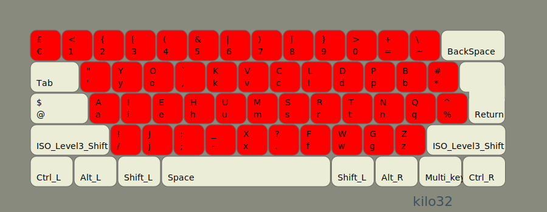
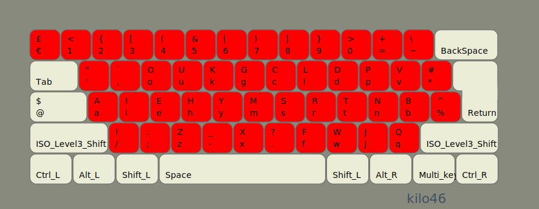

# README

Better English keyboard layouts 
generated using [kilo](https://www.tghaleb.eu.org/kilo).

## Documentation

<https://tghaleb.eu.org/kilo-layouts-en>

## TODO

- modify some layouts slightly to be similar, without affecting score.
- dead keys.
- finish level3/4.

## Contributors

- [Tarek Ghaleb](https://github.com/tghaleb) - creator and maintainer

