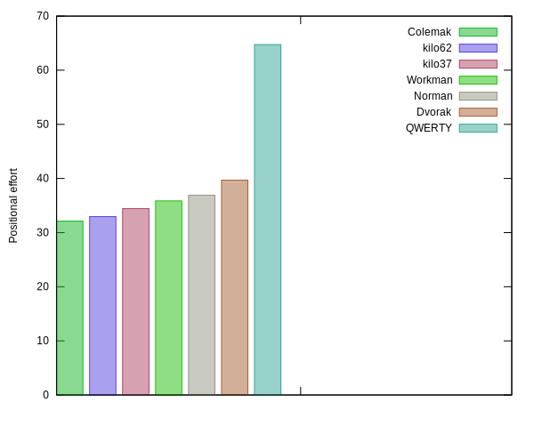
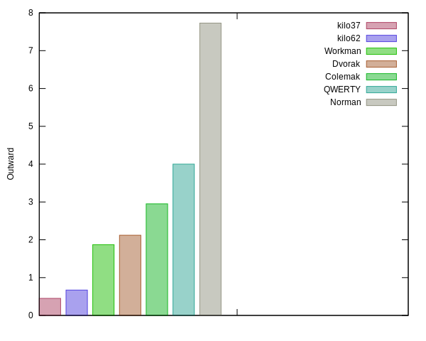

# Kilo layouts (en)

Better English keyboard layouts 
generated using [kilo](https://www.tghaleb.eu.org/kilo).
For some background on the different factors to consider in keyboard
layouts optimization, take a look at 
[layout optimization philosophy](https://www.tghaleb.eu.org/kilo/#philosophy/).

Two layouts: `kilo51` and `kilo45`. 
The difference between the two is that `kilo45` has better
combined same finger score but sacrifices some other optimizations.
`kilo51`, on the other hand, assumes same finger
with index/middle finger is not an issue and gives priority to optimizing 
other factors instead, including same ring/pinkie fingers, of course. 

They come in two flavors:

Basic:


and Scientific/International:


The international part of it is by using the compose key.

And here are some stats.

```json
name: kilo45
layout: wqdcgjyuz,'rntslhaeoi.xbpmvfk/;-
score: 290.03
positional_effort: 35.36
alternation: 70.31
text_direction: 53.87
same_hand:
  jumps: 0.07
  same_finger:
    rp: 0.46
    im: 4.51
  adjacent-mrp:
    inward: 4.61
    outward: 0.30
balance: 52.41
  rows: [16.27, 73.56, 9.99]
  fingers: [8.06, 8.60, 14.48, 21.27, 0.00, 0.00, 14.61, 14.97, 7.80, 10.03]
    indices: 35.88
    middles: 29.45
    rings: 16.40
    pinkies: 18.09

name: kilo51
layout: wvcdgjyuq.'rnstlheaoi,zxmpbf-k/;
score: 293.65
positional_effort: 35.12
alternation: 70.29
text_direction: 55.51
same_hand:
  jumps: 0.05
  same_finger:
    rp: 0.50
    im: 6.90
  adjacent-mrp:
    inward: 3.31
    outward: 0.12
balance: 52.40
  rows: [17.39, 73.44, 8.99]
  fingers: [7.94, 8.51, 12.10, 23.85, 0.00, 0.00, 18.51, 11.29, 7.80, 9.82]
    indices: 42.36
    middles: 23.39
    rings: 16.31
    pinkies: 17.76

name: QWERTY
layout: qwertyuiop[asdfghjkl;'zxcvbnm,./
score: 4.50
positional_effort: 70.78
alternation: 47.89
text_direction: 50.49
same_hand:
  jumps: 9.66
  same_finger:
    rp: 2.31
    im: 8.77
  adjacent-mrp:
    inward: 3.62
    outward: 4.00
balance: 64.23
  rows: [50.67, 31.41, 17.77]
  fingers: [8.13, 8.18, 19.09, 28.83, 0.00, 0.00, 11.29, 9.02, 12.96, 2.35]
    indices: 40.12
    middles: 28.11
    rings: 21.14
    pinkies: 10.48
```

## Features

Letter placement for QWERTY (positional effort)


Better placement,


And here is the positional effort compared



Better alternations,


Minimal jumps,


Minimal outward adjacent fingers (excluding Index finger)



Minimal Same finger (excluding Index and Middle fingers)


Jumps, outward and same_finger_rp combined compared.


Combined same finger, adds same index/middle fingers score, 
`kilo51` doesn't give this a lot of weight, `kilo45` does.


`kilo` score,


## Extra features

- Changes the placement of the shift keys, allowing the use of the thumbs
to shift instead of the pinkies. This is not a part of the optimization
stats, but if you try and don't like it you can always use the regular
shift keys.

- Uses shift keys for level 3/4 to make it easier to use these levels.
- Hijacks caps key.

## Installation

This assumes you are using `Linux`. If you plan on customizing you'll need to install
[kilo](https://www.tghaleb.eu.org/kilo) and read it's documentation.

```console
make
```

On `Linux` use the files `out/*.xkb` by appending them to
`/usr/share/X11/xkb/symbols/us` and 
editing `/usr/share/X11/xkb/rules/evdev.[xml,lst]` 
and `base.[xml/lst]`

etc. See keyboard layouts customization documentation for your distro.

On other operating systems there should be tools
to help you create customized layouts.

