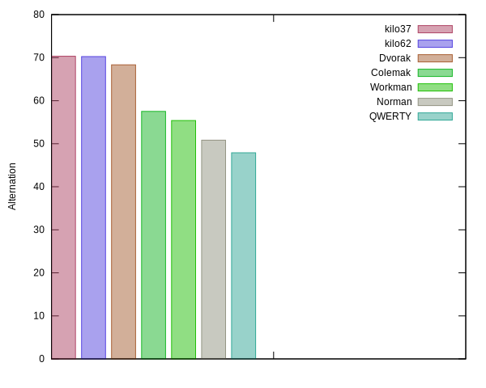
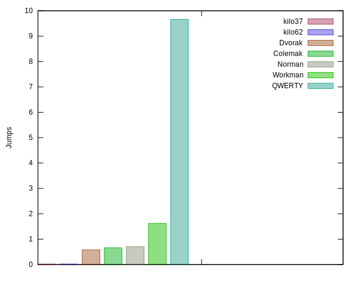
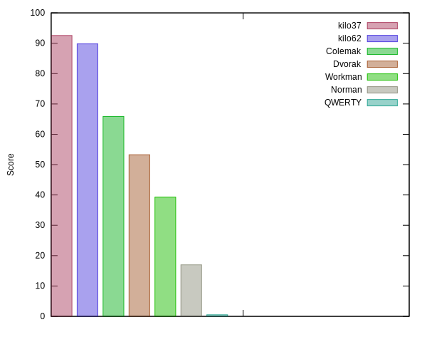

# Kilo layouts (en)

Better English keyboard layouts 
generated using [kilo](https://www.tghaleb.eu.org/kilo).
For some background on the different factors to consider in keyboard
layouts optimization, take a look at 
[layout optimization philosophy](https://www.tghaleb.eu.org/kilo/#philosophy/).

There is no *best* layout. These layouts offer different advantages
and cater to different tastes. There is also the question of how
important same finger is when it involves the stronger index and middle fingers
and how much weight to assign to it.
Here, some layouts sacrifice a little efficiency in letter placement
to achieve better overall results. If none of these layouts
meet your requirements you might want to download [kilo](https://www.tghaleb.eu.org/kilo) and create your own from scratch.

The layouts come in two flavors:

Basic:


and Scientific/International:


The international part of it is by using the compose key and the
level3/level4 keys and are still a work in progress.

Here are some stats.

```json
name: kilo37
layout: wvdcg.,y-kxrntsloaeih/qbpmzf';ju
score: 92.56
positional_effort: 34.43
alternation: 70.33
text_direction: 50.20
same_hand:
  jumps: 0.02
  same_finger:
    rp: 0.33
    im: 3.68
  adjacent-mrp:
    inward: 4.01
    outward: 0.45
balance: 52.29
  rows: [16.25, 72.41, 11.16]
  fingers: [7.95, 9.59, 14.48, 20.27, 0.00, 0.00, 18.03, 13.88, 7.72, 7.90]
    indices: 38.30
    middles: 28.36
    rings: 17.31
    pinkies: 15.85

name: kilo62
layout: wvdfgq,uy.jrntsloaeih'kbpczmx-;/
score: 89.79
positional_effort: 32.95
alternation: 70.26
text_direction: 50.05
same_hand:
  jumps: 0.02
  same_finger:
    rp: 0.44
    im: 3.65
  adjacent-mrp:
    inward: 3.95
    outward: 0.67
balance: 52.78
  rows: [17.05, 72.62, 10.15]
  fingers: [8.44, 9.59, 14.48, 20.27, 0.00, 0.00, 16.96, 15.19, 9.08, 5.81]
    indices: 37.23
    middles: 29.67
    rings: 18.67
    pinkies: 14.25

name: QWERTY
layout: qwertyuiop[asdfghjkl;'zxcvbnm,./
score: 0.52
positional_effort: 64.74
alternation: 47.89
text_direction: 50.49
same_hand:
  jumps: 9.66
  same_finger:
    rp: 2.31
    im: 8.77
  adjacent-mrp:
    inward: 3.62
    outward: 4.00
balance: 64.23
  rows: [50.67, 31.41, 17.77]
  fingers: [8.13, 8.18, 19.09, 28.83, 0.00, 0.00, 11.29, 9.02, 12.96, 2.35]
    indices: 40.12
    middles: 28.11
    rings: 21.14
    pinkies: 10.48
```

## Features

Letter placement for QWERTY (positional effort)


Better placement,


And here is the `positional_effort` compared, it's probably acceptable 
to sacrifice a little efficiency here to achieve better results overall. 


Also, note that changing the weights for keys will change the `positional effort`
score anyway. Here are the weights used.


Better `alternations`,



Minimal `jumps`,



Minimal `outward` adjacent fingers (excluding Index finger)


Minimal `same_finger_rp` (excluding Index and Middle fingers)


combined `jumps`, `same_finger_rp` and `same_finger_im`,


combined `jumps`, `outward`, `same_finger_rp` and `same_finger_im`,


`kilo` score is not very important since it depends on weights used and
configuration values, but can be used as a rough indication,



## Extra features

- Changes the placement of the shift keys, allowing the use of the thumbs
to shift instead of the pinkies. This is not a part of the optimization
stats, but if you try it and don't like it you can always use the regular
shift keys.

- Uses shift keys for level 3/4 to make it easier to use these levels.
- Hijacks caps key.

## Installation

This assumes you are using `Linux`. If you plan on customizing you'll need to install
[kilo](https://www.tghaleb.eu.org/kilo) and read it's documentation.

Get it from [repository](https://github.com/tghaleb/kilo-layouts-en),
unpack into a directory and,

```console
make
```

On `Linux` use the files `out/*.xkb` by appending them to
`/usr/share/X11/xkb/symbols/us` and 
editing `/usr/share/X11/xkb/rules/evdev.[xml,lst]` 
and `base.[xml/lst]`

etc. See keyboard layouts customization documentation for your distro.

On other operating systems there should be tools
to help you create customized layouts.


